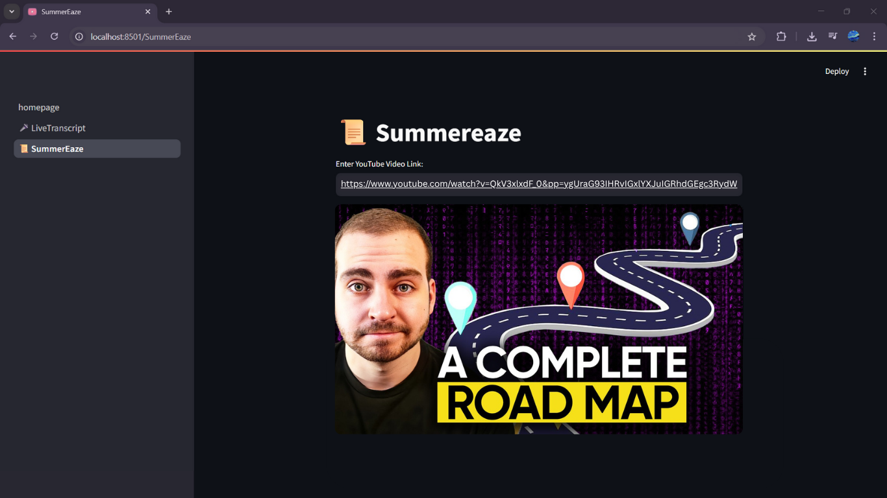
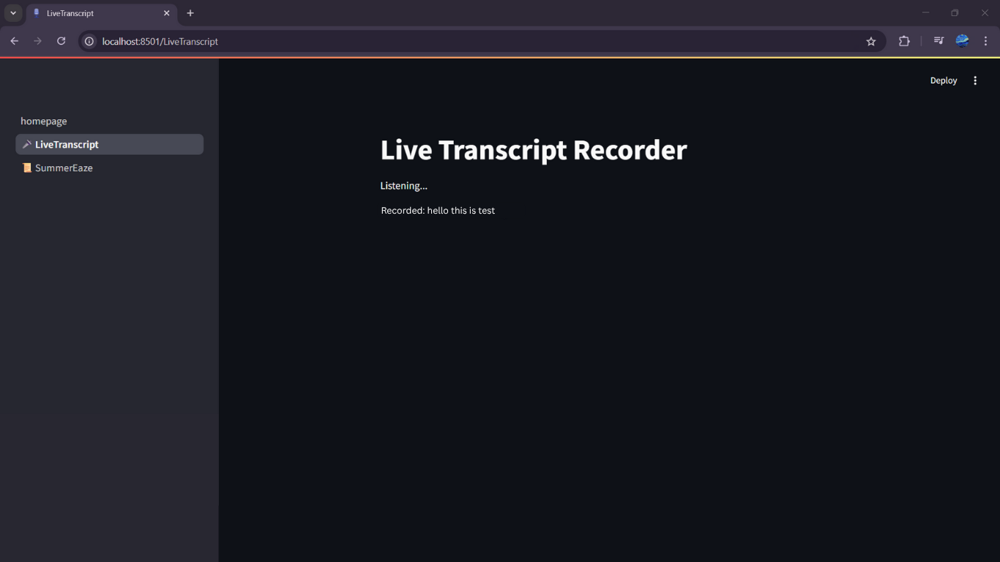

# SummarEaze
SummarEaze is a project designed to simplify learning through YouTube videos. It offers comprehensive summaries for any YouTube video, streamlining the study process and saving time for users.
Along with that it also provides an option to record live transcript and store it.

